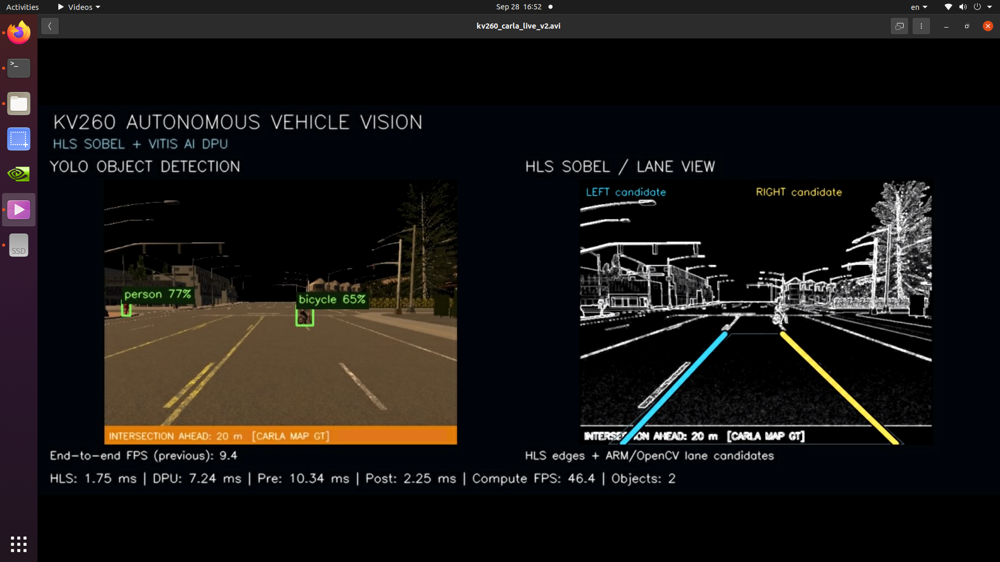

# KV260 Autonomous Vehicle Vision

Real-time autonomous-vehicle perception on the **AMD/Xilinx Kria KV260**, combining a custom **HLS Sobel accelerator** with a **Vitis AI DPU running YOLOv5 Nano**.

The project supports static images, recorded video, and a validated **live CARLA → Ethernet → KV260** pipeline with browser preview and AVI recording.

## Highlights

- Custom HLS Sobel edge accelerator
- Vitis AI DPU (`DPUCZDX8G B4096`) with YOLOv5 Nano
- PetaLinux 2022.2 runtime
- Custom Sobel DMA Linux driver
- Live CARLA 0.9.9.2 RGB input over TCP Ethernet
- YOLO object detection for cars, pedestrians, buses, trucks, and other COCO classes
- Live 1280×520 split-screen output
- HTTP/MJPEG browser preview on port `8080`
- AVI recording on the KV260
- Prebuilt validated `v1.0.0` runtime

## Quick Links

- [Quick Start](docs/QUICK_START.md)
- [Architecture](docs/ARCHITECTURE.md)
- [Build From Source](docs/BUILD_FROM_SOURCE.md)
- [Troubleshooting](docs/TROUBLESHOOTING.md)
- [Validated v1 runtime](v1/README.md)
- [CARLA V2 sender](carla/carla_kv260_live_v2.py)
- [Live benchmark](benchmarks/live_carla_benchmark.txt)
- [GitHub Release v1.0.0](https://github.com/sohan2961/kv260-autonomous-vehicle-vision/releases/tag/v1.0.0)

## System Architecture

```text
CARLA 0.9.9.2 / RGB Camera
          |
          | JPEG over TCP :5000
          v
      Ethernet
          |
          v
   AMD Kria KV260
      /        \
     v          v
HLS Sobel    Vitis AI DPU
edge image   YOLOv5 Nano
     \          /
      \        /
       v      v
      ARM/OpenCV
          |
          v
  1280×520 split-screen
      /             \
     v               v
HTTP/MJPEG :8080   AVI recording
```

**Important:** the HLS Sobel accelerator performs edge extraction. Lane-related visualization is performed by ARM/OpenCV post-processing. In the V2 CARLA sender, intersection status is taken from **CARLA map ground truth**; it is not a YOLO class.

## Validated Live Performance

Physical KV260 live CARLA test:

| Metric | Result |
|---|---:|
| Frames processed | 696 |
| HLS Sobel | 1.74246 ms |
| Preprocessing | 10.3329 ms |
| DPU execution | 7.24071 ms |
| Postprocessing | 1.97276 ms |
| Compute / frame | 21.2888 ms |
| Compute FPS | 46.9731 |
| End-to-end / frame | 97.1754 ms |
| End-to-end FPS | 10.2907 |

`Compute FPS` measures the accelerator/application compute path. `End-to-end FPS` includes the live frame-transfer pipeline but excludes browser/HTTP delivery and one-time initialization.

## Tested Platform

### Hardware

- AMD/Xilinx Kria KV260
- Zynq UltraScale+ MPSoC
- DPUCZDX8G B4096
- Custom HLS Sobel accelerator
- Direct Ethernet connection to the CARLA host

### Software

- Ubuntu 20.04
- Vivado 2022.2
- Vitis / Vitis HLS 2022.2
- PetaLinux 2022.2
- Vitis AI 3.0
- OpenCV
- CARLA 0.9.9.2
- Python 3.7

Expected DPU fingerprint:

```text
0x101000056010407
```

## Repository Layout

```text
.
├── application/     # KV260 C++ applications
├── benchmarks/      # validated performance data
├── carla/           # Windows CARLA live sender
├── docs/            # setup, architecture, build and troubleshooting
├── hls/sobel/       # HLS Sobel source + testbench
├── petalinux/       # custom recipes, DT, kernel patch and Sobel driver
├── results/         # result/screenshot guidance
├── v1/              # validated prebuilt v1 runtime (Git LFS for large files)
└── vivado/          # Vivado reproducibility notes
```

## Fastest Way to Run

1. Clone the repository.
2. Download/use the validated `v1/` runtime or Release `v1.0.0`.
3. Configure the host Ethernet as `192.168.50.1/24`.
4. Boot the KV260 (`192.168.50.2/24`).
5. Start the network vision application with browser streaming.
6. Run `carla/carla_kv260_live_v2.py` on the CARLA Windows host.
7. Open `http://192.168.50.2:8080`.

See [docs/QUICK_START.md](docs/QUICK_START.md) for exact commands.

## Prebuilt v1 Runtime

The validated artifacts are available both in [`v1/`](v1/) and as GitHub Release [`v1.0.0`](https://github.com/sohan2961/kv260-autonomous-vehicle-vision/releases/tag/v1.0.0).

Large binary files under `v1/` use **Git LFS**. After cloning, run:

```bash
git lfs install
git lfs pull
```

Verify all boot/runtime files before use:

```bash
cd v1
sha256sum -c SHA256SUMS.txt
```

## Source vs. Generated Files

This repository intentionally excludes large generated Vivado/PetaLinux build trees, caches, checkpoints, and temporary files. The version-controlled source includes the custom application code, HLS source, PetaLinux recipes, device-tree changes, DPU kernel patch, and Sobel DMA driver.

A complete one-command Vivado recreation script has **not yet been exported from the proven Vivado design**. See [vivado/README.md](vivado/README.md) for the current reproducibility status.

## License / Third-Party Components

No repository-wide license is currently declared. The project includes or depends on third-party AMD/Xilinx, Vitis AI, PetaLinux, YOLO-related, OpenCV, and CARLA components that may have their own licenses and redistribution terms. Review those terms before redistributing derived binaries or making the repository public for broader use.

## Video Demonstrations

## Result Screenshot

Below is a live result from the KV260 autonomous vehicle vision pipeline.



This screenshot shows:
- YOLOv5 Nano object detection on the left
- HLS Sobel / lane view on the right
- CARLA intersection indicator
- real-time performance statistics

### 1. Live KV260 Vision Demonstration

[Download the live YOLO + HLS Sobel demonstration](https://github.com/sohan2961/kv260-autonomous-vehicle-vision/releases/download/v1.0.0/kv260_carla_live.avi)

### 2. CARLA V2 Demonstration

[Download the CARLA V2 demonstration](https://github.com/sohan2961/kv260-autonomous-vehicle-vision/releases/download/v1.0.0/kv260_carla_live_v2.avi)

Both recordings are available under GitHub Release v1.0.0.

The videos demonstrate the live CARLA-to-KV260 processing pipeline,
including YOLOv5 Nano object detection and hardware Sobel processing.
